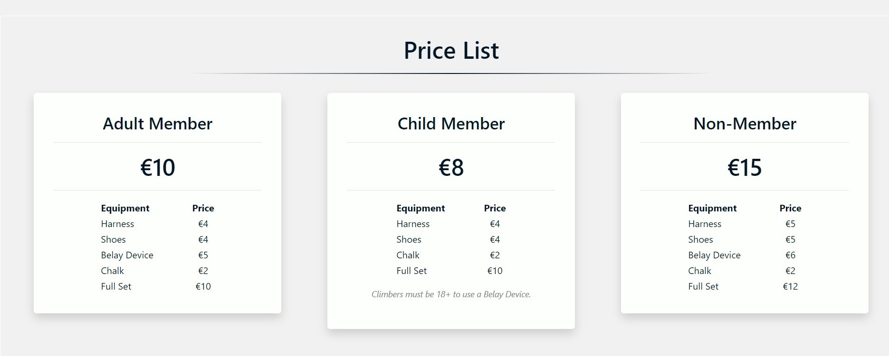

READ ME FILE

[View Live Site](https://brian-fullstack.github.io/CI_MS1_ICE/)

Tabel Of Contents
-

- [UX](#ux)
- [User Stories](#UserStories)
    - [Site User Goals](#SiteUserGoals)
    - [Site Owner Goals](#SiteOwnerGoals)
- [Features](#Features)
    - [Common Features](#Commoneatures)
    - [Home Page](#Index-HomePage)
    - [First Time](#FirstTime)
    - [Facilities](#Facilities)
    - [Events](#Events)
    - [Booking](#Booking)
    - [Features Left to Implement](#FeaturesLeftToImplememt)
- [Technologies Used](#TechnologiesUsed)
- [Testing](#Testing)
- [Deployment](#Deployment)
- [Credits](#Credits)
- [Media](#Media)
- [Acknowledgements](#Acknowledgements)

# Irish Climbing Experience (MS1)
The aim of this project is to create a responsive website for an indoor climbing gym Irish Climbing Experience (ICE). The idea for this website came from a conversation with some climbers who expressed frustration because they didn’t have any facility where they could train during the winter months.
Irish Climbing Experience is designed to be the hub of climbing in the north west of Ireland. With the sport of climbing gaining in popularity and in 2021 being the first year for climbing to be included in the Olympic Games, ICE is set on inspiring climbers and to create a new generation of climbers in Ireland. 

## UX 
Users of this website will need an easy to navigate site which guides them to the information they are looking. It should inform users of the facilities which ICE offers as well as information on prices, opening times and booking. This website satisfies these needs and more by having a navigation bar which informs the user what page they are currently on as well as linking to the other pages that they might be looking for. The use of images which relate to what the climbing gym looks like give the user an idea of the facilities, walls and some of the equipment that the will be using when they come to the gym.
The people who will utilise this website are:
-	Climbers live/travel to the north west of Ireland.
-	Families
-	Couples/Friends
-	People looking for adventure.
-	People who are interested in the sport.
-	Team building groups.
-	Physically active people.
-	Problem Solvers

## User Stories
_________________
### Site User Goals
1. As a user I want to easily find the information that I'm looking for.
2. As a user I want to find out how much it costs to climb at this gym.
3. As a user I want to find out the opening times for this gym.
4. As a user I want to find out what facilities this gym has to offer.
5. As a user I want to be able to book a slot.
6. As a user I want to find out the location of this gym.
7. As a regular user I want to find out about up comming events.
8. As a user I want to get an idea of what climbing at this gym will be like.

### Site Owner Goals
1. As a site owner I want a professional responsive website.
2. As a site owner I want to showcase the facilities at our climbing gym.
3. As a site owner I want to establish a first point of contact with customers.
4. As a site owner I want to have a way for customers to contact us.
5. As a site owner I want to promote up coming events and training courses at our climbing. 

This section is also where you would share links to any wireframes, mockups, diagrams etc. that you created as part of the design process. These files should themselves either be included as a pdf file in the project itself (in an separate directory), or just hosted elsewhere online and can be in any format that is viewable inside the browser
……………………………………………………………       
# Features

## Common Features
There are two common features which appear on every page.
1. Navigation Bar
2. Footer

## Navigation Bar
- I desigined the navigation bar using Bootstrap 4 template. I felt that it was the best way to make navigating the site as intituive as possible.
- The navigatin bar is responsive on small screens thanks to Bootstrap 4.

## Footer
- The footer is used to add extra information about Irish Climbing Experience such as: Address and links to social media.
- In keeping with the rest of the site I choose to keep the social media icons the same colour as all other bittons in the site.

### The user stories that this feature covers are:
1. As a user I want to easily find the information that I'm looking for.
1. As a site owner I want a professional responsive website.

## Feature 1 - Home Page
_____
The Home Page consists of four main sections.

1. Hero Image and a call to action button.
2. Carousel with images and links to other pages.
3. About Us which gives a brief overview of what the company is aiming to achieve.
4. Come Find Us aims to add relevent information about the gym.
### Section 1 - Hero Image and Call To Action
- I chose an image of a lady absailing because it is evokes the feeling people will have when they come to Irish Climbing Experience.

- The general background colours in the image are similar to the colour scheme throughout the site. 

- I used an opaque overlay to add contrast between the image the hero text.

- The call to action button is important to this section as it invites the user to make a booking.

### Section 2 - Carousel

- This was created using a Bootstrap 4 template. Origionally I had used bootstrap cards but realised that adding a carousel added more life to this static site.

- The images and text are an indication of what the respective page is about when they follow the link.

- I replaced the default carousel controls with font awsome icons which increased contrast with the image.

### Section 3 - About Us

- This section highlights what to company is about and trying to achieve. 

- I used a contrasting background for this section to make it more eye catching.

- All of the compy in this section as well as the copy throughout this site was wrote by myself.

### Section 4 - Come Find Us

- This section is designed to tell the user where the climbing gym is located and what times it is opened.

- The map is embeded from Google maps.

- I added the waiver form because I felt that the negitive space was unbalanced with the rest of the page.

- I added a font awsome download which navigates to an example waiver form. I have given the icon the same color as all other buttons/links on the site to keep consistancy thoughout the page.

### The user stories that this feature covers are:
1. As a user I want to easily find the information that I'm looking for.
3. As a user I want to find out the opening times for this gym.
6. As a user I want to find out the location of this gym.

## Feature 2 - First Time
_____
The First Time page consists of three sections.

1. Hero Image and About section.
2. Price List section.
3. What to Expect section.

### Section 1 - Hero Image and Heading
- I used the image for this section because it shows a stricking position of a climber.
- The header text is used to make the first time user feel welcomed.
- I reused the opaque overlay on this image to increase the contrast of the text with the image in the background.

### Section 2 - Price List
- This section is build using Bootstrap 4 cards.
- I the user gets a clear display of the prices of both members and non-members.
- I used the bootstrap class "shadow" to make the three seperate cards stand out.

### Section 3 - What to Expect
- I used this section to give a detailed overview of exactly what first time climbers can expect when they arrive.
- I gave the background a contrasting colour to make it more eye catching.

### The user stories that this feature covers are:
2. As a user I want to find out how much it costs to climb at this gym.
8. As a user I want to get an idea of what climbing at this gym will be like.

## Feature 3 - Facilities
The Facilities Page has two sections:

1. Hero Image and About
2. Features List

### Section 1 - Hero Image and Heading
- This section gives users a brief overview of the size of the walls aswell as some of the facilities in the gym.

### Section 2 - Facilities List
- This section goes into more detail about each facility and type of climbing offered at Irish Climbing Experience.
- I created seperate boxes which hold an image of that particular activity and a more detailed discription of what is involved.
- The copy in this section is adapted from climbinggeargeek.com.
- This section has a contrasting background to make each box stand out. 

### The user stories that this feature covers are:
4. As a user I want to find out what facilities this gym has to offer.
2. As a site owner I want to showcase the facilities at our climbing gym.

## Feature 4 - Events Page
The Events Page consists of three sections:

1. Hero Image and Heading
2. Event Cards
3. Registration Modal
#### Section 1 - Hero Image and  Heading
 - This section lets users know what positives can come from taking part in one of the events.
 - It also lets users know that registration is required for taking part in events.

 

 #### Section 2 - Event Cards

- This section was build using Bootstrap 4 cards.
- This section gives users a place to find all the events and courses which are on in Irish Climbing Experience.
- Each card has a registration button which prompts a modal to open up.

 #### Section 3 - Registration Modal
 - This section was built using a Bootstrap 4 template.
 - This section gives users the option to register for an event.

### The user stories that this feature covers are:
7. As a regular user I want to find out about up comming events.
5. As a site owner I want to promote up coming events and training courses at our climbing. 

## Feature 5 - Contact Page
The Contact Page consists of two sections:

1. Contact Form section
2. Registration and Waiver section

### Section 1 - Contact Form
- This section is used to let guests get in contact with the climbing gym.
- I added a shadow to this section to make it stand out from the background.

### Section 2 - Registration and Waiver
- This section is added for guests to be aware of any dangers that can be involved with climbing.
- I added a contrasting background to seperate this section from the form section.
- It includes a downloadable example waiver form which I obtained from amazonaws.com

### The user stories that this feature covers are:
4. As a site owner I want to have a way for customers to contact us.
8. As a user I want to get an idea of what climbing at this gym will be like.

 ## Feature 6  - Booking Modal
- The Booking Modal is created using Bootstrap 4 modal template.
- This section is located on every page via the navbar.
- I added custom HTML and CSS to the Bootstrap modal to style and layout the form.
- The confirm button and rest button both use th colour scheme which is found thoughout the rest of the site.

### The user stories that this feature covers are:

5. As a user I want to be able to book a slot.

### Features Left to Implement
- In the future I would like to implement a members Log In page for gym members.
- I would like to add the colour coded grading chart used for specifing the route grade in the climbing gym.
- I think this page would benifit from adding a place where people can leave reviews about the climbing gym.
- I think adding a promotional video of the climbing gym would give users a great idea of what exactly this climbing gym is like.

## Languages, Frameworks and Technologies Used
___

- [HTML](https://html.com/html5/) is used for adding all the copy and images to each page as well as creating forms and lists.

- [CSS](https://www.w3schools.com/Css/) is used throughout this project to style the overall website.

___

- [Bootstrap 4](https://getbootstrap.com/) came in very usefull when making the site responsive across a range of devices as well as a source of information.

- [Coolers](https://coolors.co/) is wehere I fould the colour pallet used throughtout this site.

- [Font Awsome](https://fontawesome.com/) was used for adding Icons such as social icons, map pin, clock and download icon.

- [Unsplash](https://unsplash.com/) was where I got of the images on this site license free.

- [GitHub](https://github.com/) is used as a remote repository for the projects source code.

- [Git](https://git-scm.com/) was used to commit and push the code to GitHub.

- [Visual Studio Code](https://visualstudio.microsoft.com/) is the IDE i used for writing the code for this project.

- [Google Maps](https://www.google.ie/maps) was used for embeding the map in the come find us section.

- [Balsamiq](https://balsamiq.com/) was used for creating wireframes for all pages.

- [Image Resizer](https://imageresizer.com/) is where I reduced the size of the images inorder to reduce the loadtime of each page.
## Validations

# Testing

In this section, you need to convince the assessor that you have conducted enough testing to legitimately believe that the site works well. Essentially, in this part you will want to go over all of your user stories from the UX section and ensure that they all work as intended, with the project providing an easy and straightforward way for the users to achieve their goals.

## Testing User Stories
| Feature | Action | Expected Result |  Actual Result |
|---------|--------|-----------------|---------------|
|1.  As a user I want to find out how much it costs to climb at the gym. | To achieve this the user navigates to the First Time page in the navigation bar.| I expect that the user will find the information that they are looking for.| Worked as expected|

| Feature | Action | Expected Result |  Actual Result |
|---------|--------|-----------------|---------------|
|2. As a user I want to find out the opening times for this gym.| User needs to scroll down to the Come Find Us section on the Home page |The user will find opening times for weekdays and weekends| Worked as expected|

| Feature | Action | Expected Result |  Actual Result |
|---------|--------|-----------------|---------------|
|3. As a user I want to find out what facilities this gym has to offer.|User will click on the Facilities link in the navigation bar| When user follows the Facilities link they will find information on all facilities avaliable at the gym| Worked as expected.|

| Feature | Action | Expected Result |  Actual Result |
|---------|--------|-----------------|---------------|
|4. As a user I want to be able to book a climbing slot before I go to the gym.| User will click on the Booking link in the navigation bar.| When user clicks the booking button a model form will pop up for the user to book a visit.|Worked as expected.|

| Feature | Action | Expected Result |  Actual Result |
|---------|--------|-----------------|---------------|
|5. As a user I want to find out the location of this gym.|User needs to scroll down to the come find us section of the home page to find a map or to the footer of any page to find the address.|When user scrolls down to the come find us section or footer they will find the address and a map of where the gym is located.| Worked as expected.|

| Feature | Action | Expected Result |  Actual Result |
|---------|--------|-----------------|---------------|
|6. As a regular user I want to find out about up comming events.|User will click on the Events link in the navigation bar| When user clicks on the Events link they will find information on upcoming events|Worked as expected|

| Feature | Action | Expected Result |  Actual Result |
|---------|--------|-----------------|---------------|
|8. As a user I want to get an idea of what climbing at this gym will be like.|User gathers a feeling of the experience they will have by going through the site|As the user navigates through the site the abundance of images and discriptive language will discribe what its like to climb in the gym.|Worked as expected.|

### Testing Site Owner Goals
| Feature | Action | Expected Result | Actual Result |
|---------|--------|-----------------|---------------|
|As a site owner I want a professional responsive website.||||

| Feature | Action | Expected Result | Actual Result |
|---------|--------|-----------------|---------------|
|As a site owner I want to showcase the facilities at our climbing gym.|The use of images and detailed information showcases what the gym has to offer. |Both site owner and user will see high quality images of the gym on every page. | Worked as expected|

| Feature | Action | Expected Result | Actual Result |
|---------|--------|-----------------|---------------|
|As a site owner I want to establish a first point of contact with customers.||||

| Feature | Action | Expected Result | Actual Result |
|---------|--------|-----------------|---------------|
|As a stie owner I want to have a point of contact with guests.||||
|As a site owner I want to promote up coming events and training courses at our climbing.|The events page of the site will have information about up coming events in the gym.|That there will be clear and detailed information on what up coming events will be held in the gym|Worked as expected.|

### HTML Validation
I used [W3C Validator](https://validator.w3.org/) to validate HTML on each page.

- First Time

Initally I recieved 3 errors:
1. Error 1: "Element "div" not allowed as child of element "ul" in this context."

Fix: I fixed This error by changing the "btn-group" from a "div" to a "li".

2. Error 2: "Bad value # for attribute method on element form."

Fix: I simply fixed this error by removing the method in the form tag since it is not needed for this project.

3. Error 3: "Attribute type not allowed on element textarea at this point."

Fix: I fixed this error by removing "type="text" attribute from the textarea element.

After I addressed these issues this page passed with 0 errors and 0 warnings.

### CSS Validation
I used [Jigsaw CSS Validator](https://jigsaw.w3.org/css-validator/) to validate my CSS.

My CSS came back with No Errors Found.

For any scenarios that have not been automated, test the user stories manually and provide as much detail as is relevant. A particularly useful form for describing your testing process is via scenarios, such as:

1. Contact form:
    1. Go to the "Contact Us" page
    2. Try to submit the empty form and verify that an error message about the required fields appears
    3. Try to submit the form with an invalid email address and verify that a relevant error message appears
    4. Try to submit the form with all inputs valid and verify that a success message appears.

In addition, you should mention in this section how your project looks and works on different browsers and screen sizes.

You should also mention in this section any interesting bugs or problems you discovered during your testing, even if you haven't addressed them yet.

If this section grows too long, you may want to split it off into a separate file and link to it from here.

## Deployment

I deployed this website using GitHub pages. The process I used is as follows:
1. I logged into my Github account and selected my MS1 project from my repositories.
2. I clicked on 'Settings' in the repository.
3. In the menu on the left i clicked on 'Pages'.
4. I then clicked on 'Source'.
5. I clicked on the dropdown menu that said 'None' and then selected 'Main'.
6. After the page reloaded I clicked on the link to the deployed site.

In addition, if it is not obvious, you should also describe how to run your code locally.

## Credits

### Content
- The text for section Y was copied from the [Wikipedia article Z](https://en.wikipedia.org/wiki/Z)

### Media
- The photos used in this site were obtained from Unsplash.com. 

### Acknowledgements
- I gathered most of my inspiration ofr this project from my local climbing club, the experience of friends aswell as my own personal experience.
- W3schools.com was a great resource for me during this project.
- I would like to thanks to my mentor from whom I received great feedback throughout this project.
